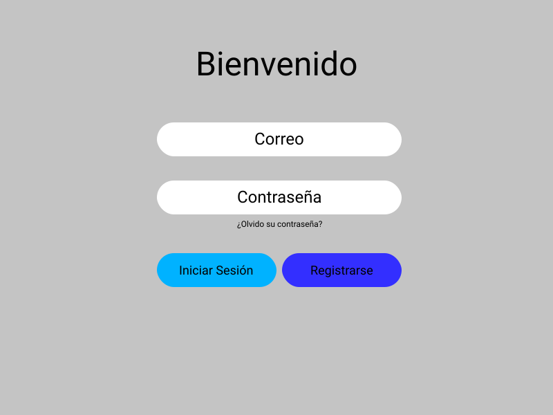

# Casos de uso

### Caso de uso: Carga de cliente

- El usuario ingresa a la aplicación web
- El sistema le presenta al usuario la pantalla para iniciar sesión.
- Si el usuario es nuevo, presiona registrarse.
  - El sistema redirige al usuario a la pantalla de registro.
  - El usuario ingresa sus datos.
  - El usuario presiona registrarse.
  - El sistema registra al usuario en la base de datos.
  - El sistema redirige al usuario a la página de inicio de sesión.

  

### Caso de uso: Inicio de sesión

- El usuario ingresa a la aplicación web
- El sistema le presenta al usuario la pantalla para iniciar sesión.
- El usuario ingresa su correo y contraseña.
- El sistema confirma los datos.
- El sistema redigire al usuario a la página de pedidos.

  

### Caso de uso: Solicitud de pedidos.

- El sistema le presenta al usuario la página de pedidos.
- El usuario seleciona su pedido.
- El sistema registra el pedido.
- El sistema le pasa el pedido a un empleado.
- El empleado confirma el pedido.
- El sistema confirma al usuario que el pedido se encuentra en camino.

