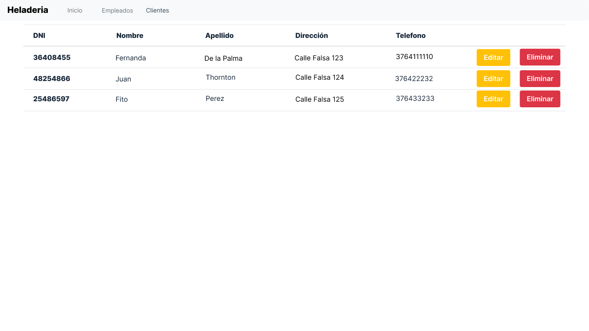

# Diseño y planificación - Iteración 1

# Trabajo en equipo

El lider del equipo para esta iteración ha sido Rodriguez Fernando.

El trabajo realizado ha sido atender las dos historias de usuario planificadas en el roadmap general del proyecto, correspondientes a la iteración 1. Donde cada uno de los integrantes del grupo atendio una historia. Haciendo por separado el wireframe y los casos de uso correspondientes a cada una de ellas.
  
# Diseño Orientado a Objetos

Clases que se pretenden implementar en esta iteración

# Wireframe y Casos de uso
### Caso de uso: Crear Empleado

 - El usuario visita la aplicacion web mediante un navegador web.
 - El sistema muestra la pagina index de la aplicacion web.
 - El usuario presiona el boton de crear un nuevo empleado
 - El sistema muestra dos botones donde cada uno muestra un tipo de empleado diferente que se puede crear. Puede tratarse deun jornalero o un repartidor.
 - El usuario selecciona uno de las dos opciones.
 - El sistema muestra el formulario con los campos correspondientes a la seleccion del usuario.
 - El usuario rellena los campos solicitados con los datos correspondientes a un nuevo empleado
 - El usuario presiona el boton de guardar
 - El sistema guarda en la base de datos los datos ingresados.

### Caso de uso: Listar Empleado
- El usuario selecciona el item empleados en la barra de navegacion del navegador web
- El sistema devuelve la lista de empleados registrados en la base de datos

### Caso de uso: Modificar Empleado
- El usuario ejecuta el caso de uso Listar Empleado.
- El usuario presiona el boton de editar ubicado en la fila correspondiente del empleado que pretende modificar.
- El sistema devuelve un formulario editable con los datos del empleado seleccionado.
- El usuario edita los campos necesarios del empleado
- El usuario presionar el boton de guardar.
- El sistema edita los campos modificados en el registro del empleado correspondiente en la base de datos.

### Caso de uso: Eliminar Empleado
- El usuario ejecuta el caso de uso Listar empleado.
- El usuario presiona el boton de eliminar ubicado en la fila correspondiente del empleado que pretende eliminar
- El sistema devuelve un mensaje de advertencia preguntando si el usuario esta seguro de eliminar el registro del empleado
- El usuario selecciona que si esta seguro de eliminar el registro del empleado
- El sistema elimina el registro del empleado correspondiente en la base de datos.

# 

### Caso de uso: Crear Cliente

 - El usuario visita la aplicacion web mediante un navegador web.
 - El sistema muestra la pagina index de la aplicacion web.
 - El usuario presiona el boton de crear un nuevo Cliente
 - El sistema muestra el formulario con los campos. correspondientes a la seleccion del usuario.
 - El usuario rellena los campos solicitados con los datos correspondientes a un nuevo cliente.
 - El usuario presiona el boton de crear cliente.
 - El sistema guarda en la base de datos los datos ingresados.

### Caso de uso: Listar Cliente
- El usuario selecciona el item clientes en la barra de navegacion del navegador web
- El sistema devuelve la lista de clientes registrados en la base de datos

### Caso de uso: Modificar Cliente
- El usuario ejecuta el caso de uso Listar Empleado.
- El usuario presiona el boton de editar ubicado en la fila correspondiente del cliente que pretende modificar.
- El sistema devuelve un formulario editable con los datos del empleado seleccionado.
- El usuario edita los campos necesarios del cliente
- El usuario presionar el boton de guardar cambios.
- El sistema edita los campos modificados en el registro del empleado correspondiente en la base de datos.

### Caso de uso: Eliminar Cliente
- El usuario ejecuta el caso de uso Listar cliente.
- El usuario presiona el boton de eliminar ubicado en la fila correspondiente del cliente que pretende eliminar.
- El sistema devuelve un mensaje de advertencia preguntando si el usuario esta seguro de eliminar el registro del cliente.
- El usuario selecciona que si esta seguro de eliminar el registro del cliente.
- El sistema elimina el registro del cliente correspondiente en la base de datos.

# Backlog de iteración

- Historia de usuario CRUD de clientes: realizada por Viera Ruben.
- Historia de usuario CRUD de empleados: realizada por Rodriguez Fernando.

# Tareas

- Crear las relaciones entre las clases
- Verificar que estas persisten en la base de datos
- Crear el controlador correspondiente
- Implementar las vistas.