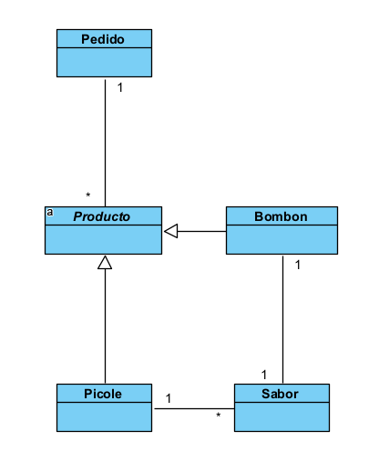

# Diseño y planificación - Iteración 2

# Trabajo en equipo

El lider del equipo para esta iteración ha sido Rodriguez Fernando.

El trabajo realizado ha sido atender las dos historias de usuario planificadas en el roadmap general del proyecto, correspondientes a la iteración 2. Donde cada uno de los integrantes del grupo atendió una historia. Haciendo por separado el wireframe y los casos de uso correspondientes a cada una de ellas.
  
# Diseño Orientado a Objetos

Clases que se pretenden implementar en esta iteración

# Wireframe y Casos de uso

### Caso de uso: Crear Producto

 - El usuario visita la aplicacion web mediante un navegador web.
 - El sistema muestra la pagina index de la aplicacion web.
 - El usuario presiona el boton de crear un nuevo producto.
 - El sistema muestra dos botones donde cada uno muestra un tipo de producto diferente que se puede crear. Puede tratarse de dos tipos diferentes de bolsas de helados: bombon o picole.
 - El usuario selecciona uno de las dos opciones.
 - El sistema muestra una opcion para seleccionar el tipo de sabor del producto.
 - El usuario selecciona el tipo de sabor.
 - El usuario presiona el boton de agregar.
 - El sistema crea en la base de datos el producto.
  
### Caso de uso: Modificar Producto

- El usuario ejecuta el caso de uso Listar productos.
- El usuario presiona el boton de editar ubicado en la fila correspondiente del producto que pretende modificar.
- El sistema devuelve un formulario con los datos que pueden ser editados del producto.
- El usuario edita los campos habilitados.
- El usuario presionar el boton de guardar.
- El sistema edita los campos modificados en el registro del producto correspondiente en la base de datos.

### Caso de uso: Eliminar Producto

- El usuario ejecuta el caso de uso Listar productos.
- El usuario presiona el boton de eliminar ubicado en la fila correspondiente del producto que pretende eliminar.
- El sistema devuelve un mensaje de advertencia,preguntando si el usuario esta seguro de eliminar el registro del producto.
- El usuario selecciona que si esta seguro de eliminar el registro del producto.
- El sistema elimina el registro del producto correspondiente en la base de datos.
  
### Caso de uso: Listar Producto

- El usuario selecciona el item productos en la barra de navegacion del sistema.
- El sistema devuelve la lista de productos registrados en la base de datos.
  
### Caso de uso: Crear Pedido
 - El usuario visita la aplicacion web mediante un navegador web.
 - El sistema muestra la pagina index de la aplicacion web.
 - El usuario presiona el boton de realizar un pedido
 - El sistema muestra un formulario donde el usuario puede seleccionar los productos disponibles, y la cantidad que el usuario desea pedir.
 - El usuario selecciona los productos y cantidad deseados.
 - El sistema muestra un resumen del pedido incluyendo el precio final del mismo.
 - El usuario confirma el pedido
 - El sistema guarda el pedido en la base de datos.

### Caso de uso: Modificar Pedido
- El usuario ejecuta el caso de uso Listar Pedido.
- El usuario presiona el boton de editar ubicado en la fila correspondiente del pedido que pretende modificar.
- El sistema devuelve un formulario editable con los datos del pedido seleccionado.
- El usuario edita los campos habilitados del pedido.
- El usuario presionar el boton de guardar.
- El sistema edita los campos modificados en el registro del pedido correspondiente en la base de datos.
  
### Caso de uso: Eliminar Pedido
- El usuario ejecuta el caso de uso Listar pedidos.
- El usuario presiona el boton de eliminar ubicado en la fila correspondiente del pedido que pretende eliminar
- El sistema devuelve un mensaje de advertencia preguntando si el usuario esta seguro de eliminar el registro del pedido
- El usuario selecciona que si esta seguro de eliminar el registro del pedido
- El sistema elimina el registro del pedido correspondiente en la base de datos.
  
### Caso de uso: Listar Pedido
- El usuario selecciona el item pedidos en la barra de navegacion del sistema.
- El sistema devuelve la lista de pedidos registrados en la base de datos.

# Backlog de iteración

- Historia de usuario CRUD de productos: realizada por Viera Ruben.
- Historia de usuario CRUD de pedidos: realizada por Rodriguez Fernando.

# Tareas

- Crear las clases necesarias.
- Crear las relaciones entre las clases.
- Crear los controladorres correspondientes.
- Implementar los templates correspondientes.
- Conectar los templates con los controladores correspondientes.
- Verificar que los datos ingresados via frontend persistan en la base de datos.
