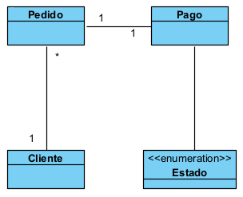
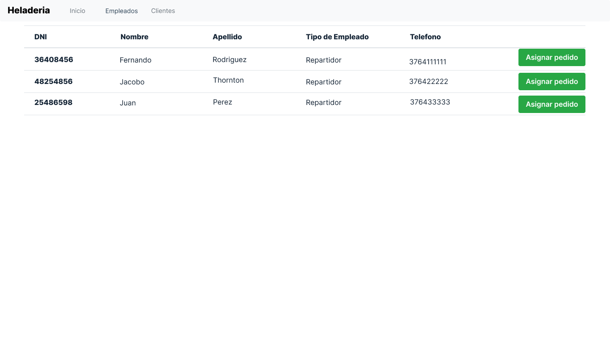
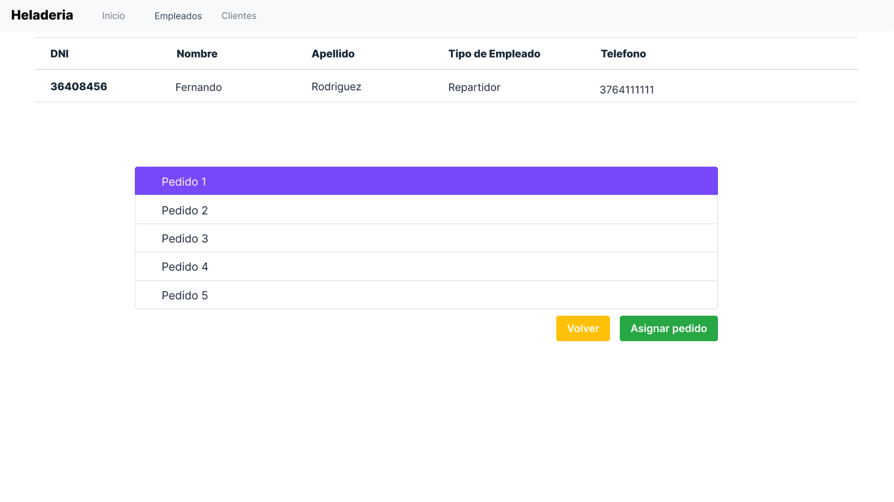
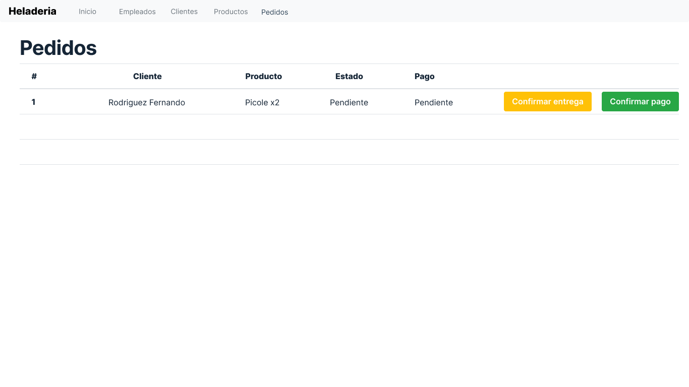

# Diseño y planificación - Iteración 2

# Trabajo en equipo

El lider del equipo para esta iteración ha sido Rodriguez Fernando.

El trabajo realizado ha sido atender las dos historias de usuario planificadas en el roadmap general del proyecto, correspondientes a la iteración 3. Donde cada uno de los integrantes del grupo atendió una historia. Haciendo por separado el wireframe y los casos de uso correspondientes a cada una de ellas.
  
# Diseño Orientado a Objetos

Clases que se pretenden implementar en esta iteración

# Wireframe y Casos de uso

### Caso de uso: Asignar pedido

 - El administrador visita la aplicacion web mediante un navegador web.
 - El sistema muestra la pagina index de la aplicacion web.
 - El administrador presiona el boton empleados.
 - El sistema muestra los botones para seleccionar el tipo de empleado.
 - El administrador selecciona repartidores.
 - El sistema musetra la lista de repartidores
 - El administrador selecciona un repartidor.
 - El sistema muestra los detalles del repartidor seleccionado
 - El administrador selecciona el boton "asignar pedido"
 - El sistema muestra una lista de pedidos activos en el sistema.
 - El administrador selecciona un pedido que va a ser asignado al sistema
 - El sistema informa que el pedido ha sido asignado al repartidor.

### Caso de uso: Cambiar estado

 - El repartidor visita la aplicacion web mediante un navegador web.
 - El sistema muestra la pagina index de la aplicacion web.
 - El repartidor presiona el boton de pedidos para ver sus pedidos activos.
 - El sistema una lista de pedidos activos para ese repartidor.
 - El repartidor selecciona un pedido del cual ha recibido un pago.
 - El sistema muestra el detalle del pedido.
 - El repartidor selecciona el boton de confirmar pago
 - El sistema cambia el estado del pago de "pendiente" a "completado"
 - El sistema guarda el pedido pagado a la base de datos.

# Backlog de iteración

- Historia de usuario asignar pedidos a repartidores: realizada por Rodriguez Fernando
- Historia de usuario gestion de pagos: realizada por Viera Ruben.

# Tareas

- Crear las clases necesarias.
- Crear las relaciones entre las clases.
- Crear los controladorres correspondientes.
- Implementar los templates correspondientes.
- Conectar los templates con los controladores correspondientes.
- Verificar que los datos ingresados via frontend persistan en la base de datos.
