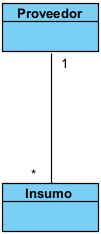
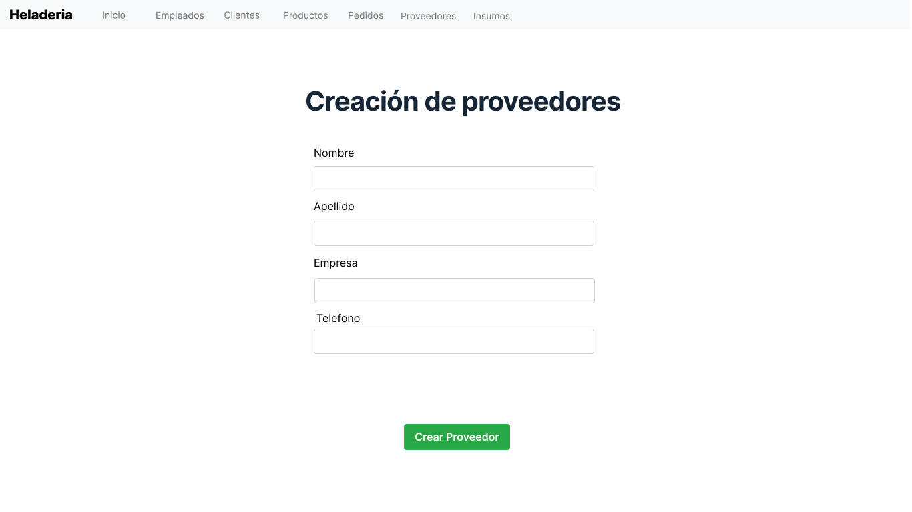
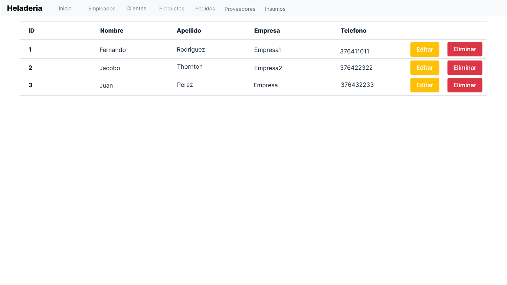
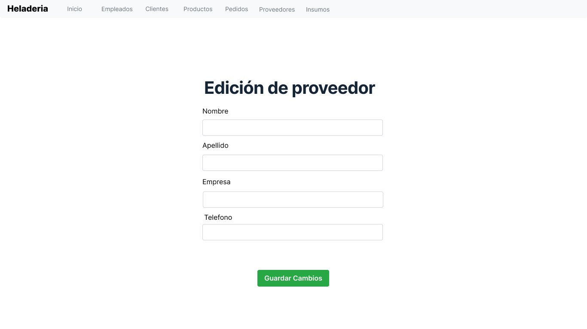
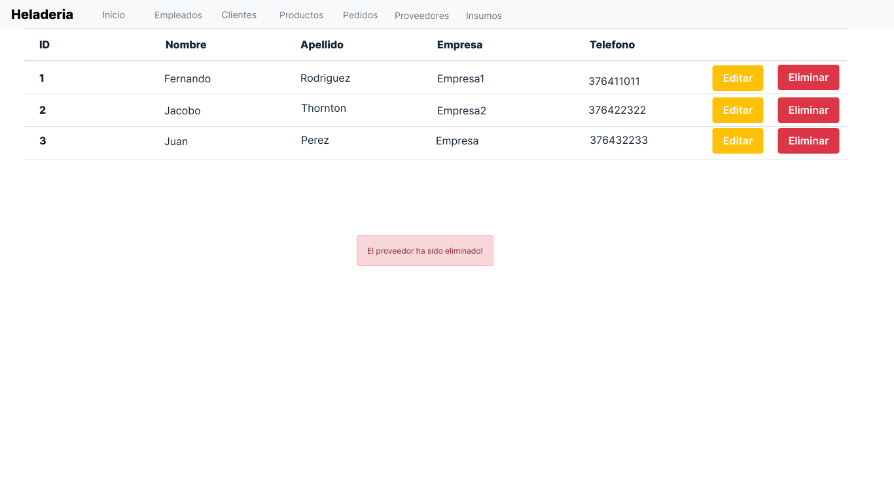
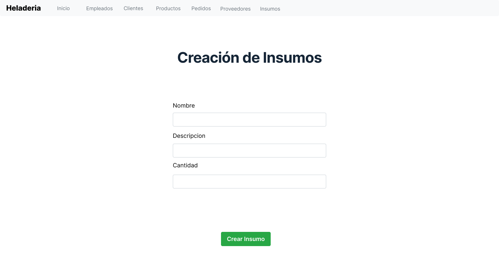
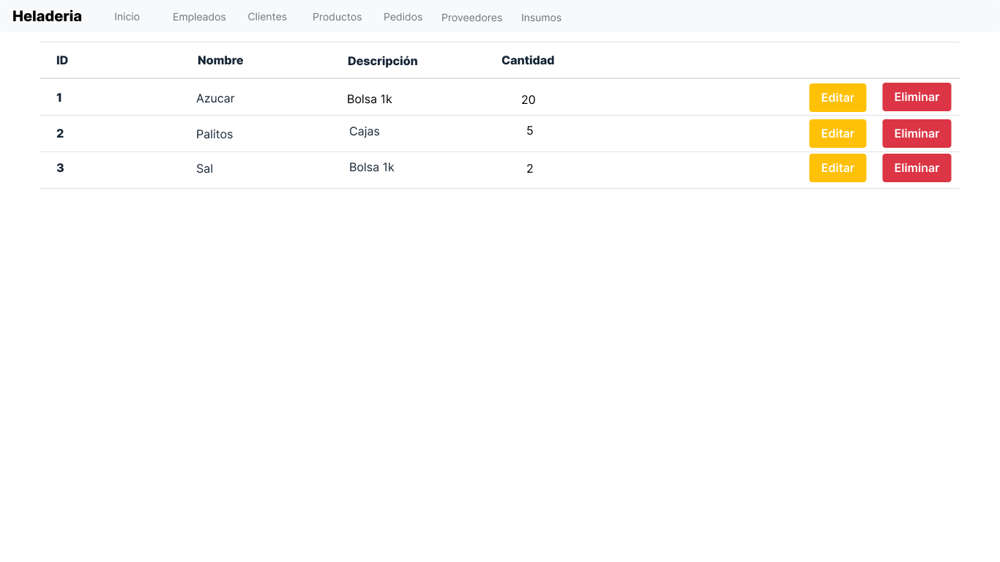
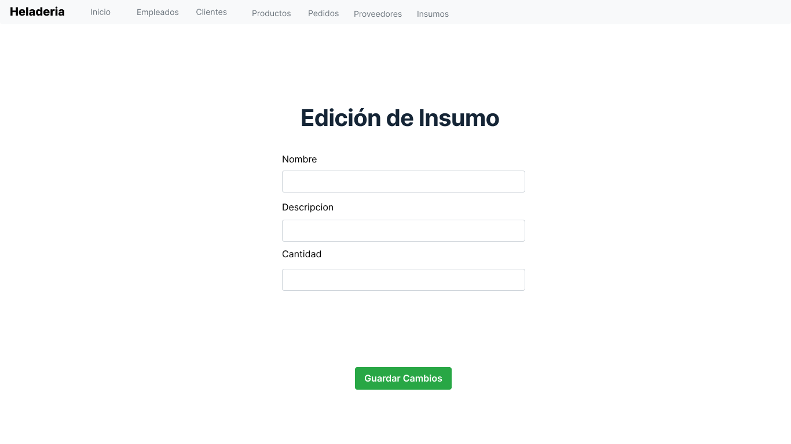
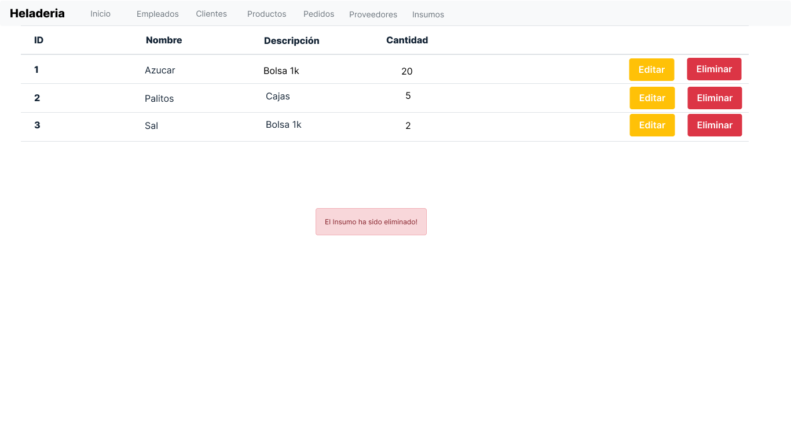

# Diseño y planificación - Iteración 4

# Trabajo en equipo

El lider del equipo para esta iteración ha sido Rodriguez Fernando.

El trabajo realizado ha sido atender la historia de usuario planificada en el roadmap general del proyecto, correspondientes a la iteración 4. Donde cada uno de los integrantes del grupo atendió la historia. Haciendo el wireframe y los casos de uso correspondientes a la historia de usuario.
  
# Diseño Orientado a Objetos

Clases que se pretenden implementar en esta iteración

# Wireframe y Casos de uso

### Caso de uso: Crear Proveedor

 - El usuario visita la aplicacion web mediante un navegador web.
 - El sistema muestra la pagina "index" de la aplicacion web.
 - El usuario presiona el boton de proveedores en la barra de navegacion
 - El sistema muestra un boton para crear un nuevo proveedor
 - El usuario presiona el boton de crear un proveedor
 - El sistema muestra el formulario con los campos correspondientes a la seleccion del usuario.
 - El usuario rellena los campos solicitados con los datos correspondientes a un nuevo proveedor
 - El usuario presiona el boton de guardar
 - El sistema guarda en la base de datos los datos ingresados.

### Caso de uso: Listar Proveedores
- El usuario selecciona el item proveedores en la barra de navegacion del navegador web
- El sistema devuelve la lista de proveedores registrados en la base de datos

### Caso de uso: Modificar Proveedor
- El usuario ejecuta el caso de uso Listar Proveedor.
- El usuario presiona el boton de editar ubicado en la fila correspondiente del proveedor que pretende modificar.
- El sistema devuelve un formulario editable con los datos del proveedor seleccionado.
- El usuario edita los campos necesarios del proveedor
- El usuario presionar el boton de guardar.
- El sistema edita los campos modificados en el registro del proveedor correspondiente en la base de datos.

### Caso de uso: Eliminar Proveedor
- El usuario ejecuta el caso de uso Listar Proveedor.
- El usuario presiona el boton de eliminar ubicado en la fila correspondiente del proveedor que pretende eliminar
- El sistema devuelve un mensaje de advertencia preguntando si el usuario esta seguro de eliminar el registro del proveedor
- El usuario selecciona que si esta seguro de eliminar el registro del proveedor
- El sistema elimina el registro del proveedor correspondiente en la base de datos.

### Caso de uso: Crear Insumo
 - El usuario visita la aplicacion web mediante un navegador web.
 - El sistema muestra la pagina "index" de la aplicacion web.
 - El usuario presiona el boton de insumos en la barra de navegacion
 - El sistema muestra un boton para crear un nuevo insumo
 - El usuario presiona el boton de crear un insumo
 - El sistema muestra el formulario con los campos correspondientes a la seleccion del usuario.
 - El usuario rellena los campos solicitados con los datos correspondientes a un nuevo insumo
 - El usuario presiona el boton de guardar
 - El sistema guarda en la base de datos los datos ingresados.

### Caso de uso: Listar Insumos
- El usuario selecciona el item Insumos en la barra de navegacion del navegador web
- El sistema devuelve la lista de insumos registrados en la base de datos

### Caso de uso: Modificar Insumo
- El usuario ejecuta el caso de uso Listar Insumo.
- El usuario presiona el boton de editar ubicado en la fila correspondiente del insumo que pretende modificar.
- El sistema devuelve un formulario editable con los datos del insumo seleccionado.
- El usuario edita los campos necesarios del insumo
- El usuario presionar el boton de guardar.
- El sistema edita los campos modificados en el registro del insumo correspondiente en la base de datos.

### Caso de uso: Eliminar Insumo
- El usuario ejecuta el caso de uso Listar Insumos.
- El usuario presiona el boton de eliminar ubicado en la fila correspondiente del insumo que pretende eliminar
- El sistema devuelve un mensaje de advertencia preguntando si el usuario esta seguro de eliminar el registro del insumo
- El usuario selecciona que si esta seguro de eliminar el registro del insumo
- El sistema elimina el registro del insumo correspondiente en la base de datos.

  
# Backlog de iteración

- Historia de usuario control de stock: realizada por Rodriguez Fernando y Viera Ruben

# Tareas

- Crear las clases necesarias.
- Crear las relaciones entre las clases.
- Crear los controladorres correspondientes.
- Implementar los templates correspondientes.
- Conectar los templates con los controladores correspondientes.
- Verificar que los datos ingresados via frontend persistan en la base de datos.
