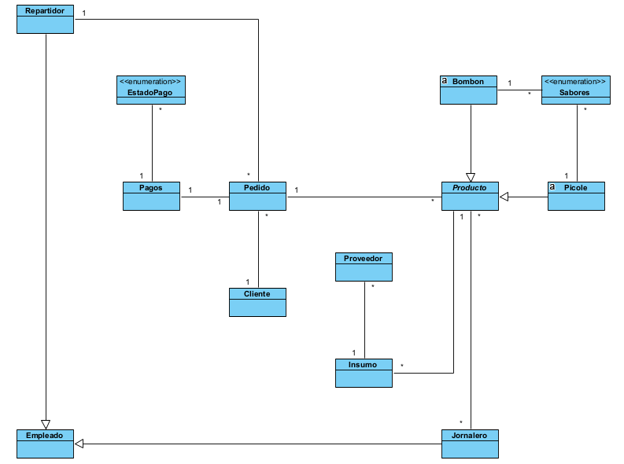
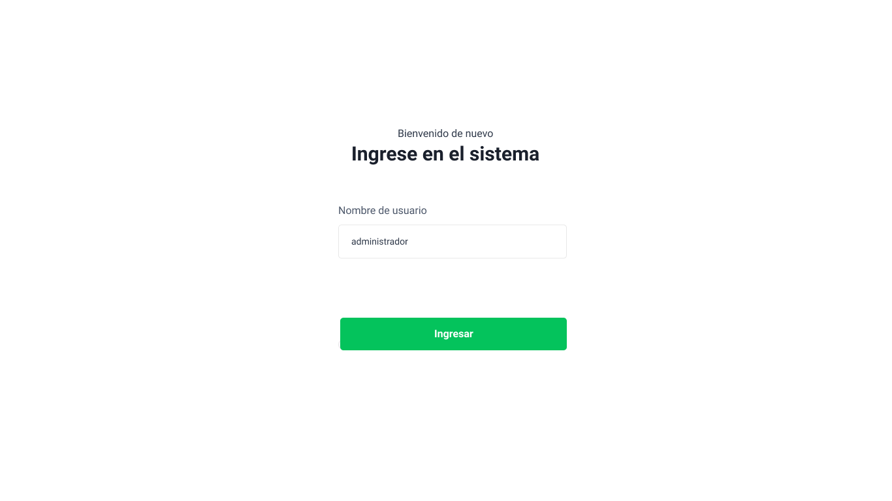

# Diseño y planificación - Iteración 5

# Trabajo en equipo

El lider del equipo para esta iteración ha sido Viera Angel Ruben.

El trabajo realizado ha sido atender la historia de usuario planificada en el roadmap general del proyecto, correspondiente a la iteración 5. Donde cada uno de los integrantes del grupo atendió la historia. Haciendo el wireframe y los casos de uso correspondientes a la historia de usuario.
  
# Diseño Orientado a Objetos

Las clases que se pretenden implementar son todas las clases detalladas en las diferentes iteraciones anteriores.

# Wireframe y Casos de uso

### Caso de uso: Ingresar al Sistema

 - El usuario visita la aplicacion web mediante un navegador web.
 - El sistema muestra un formulario de ingreso
 - El usuario ingresa su nombre de usuario
 - El usuario presiona el boton de ingresar al sistema
 - El sistema muestra la pagina principal del mismo.

# Backlog de iteración

- Historia de usuario ingreso al sistema: realizada por Rodriguez Fernando y Viera Ruben

# Tareas

- Implementar el template correspondiente.
- Conectar el template con la clase de aplicacion principal del sistema.
